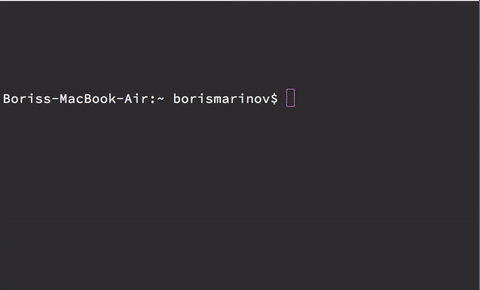

cli-stopwatch
===
A stopwatch for your terminal

Installation
---
Install with `npm install -g cli-stopwatch`

Usage
---
Go `cli-stopwatch` to start a timer.
Go `cli-stopwatch _<minutes>_` or  `cli-stopwatch _<minutes>_:<seconds>` to start a countdown.

